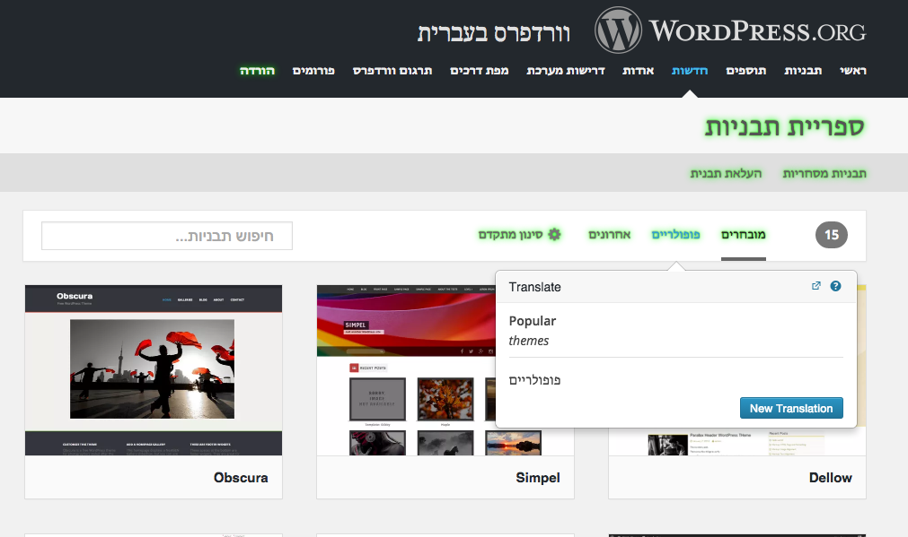

# Community Translator
The Community Translator aims to be a front end tool for translations stored in GlotPress.
It does so by providing on-screen translation ability, so that the community can easily fix a missing translation in-place and make use of the context in which the string appears.

### Requirements
- jQuery
- The [`gp-translation-extended-api`](https://github.com/automattic/gp-translation-extended-api) plugin for GlotPress

### Build
To create the `community-translator.js` and `community-translator.css` files which should be loaded in the translatable site, run `make`.
You can also use `fswatch-run lib css make` to watch the directories `lib` and `css` for changed files and run `make` automatically.

### Loading
- (Coming soon)

### Debugging
Set or add `community-translator` to the `debug` value in localeStorage. i.e: `localStorage.setItem( 'debug', 'community-translator' )`

